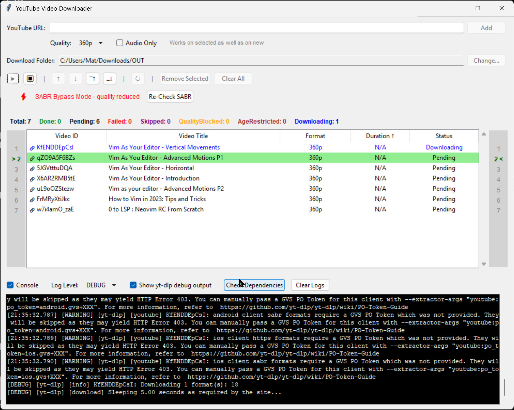
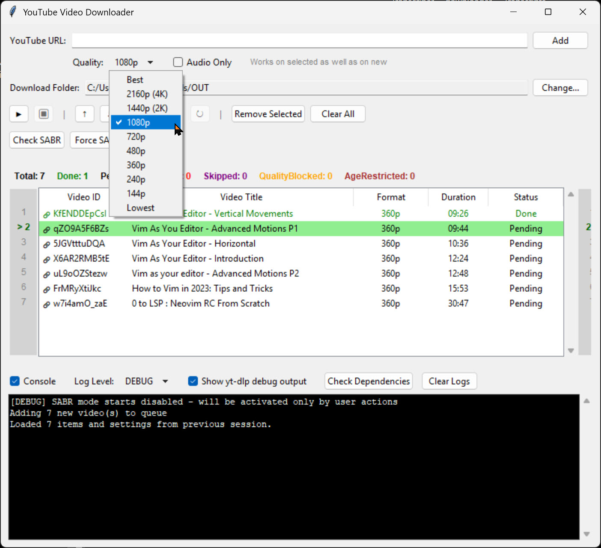
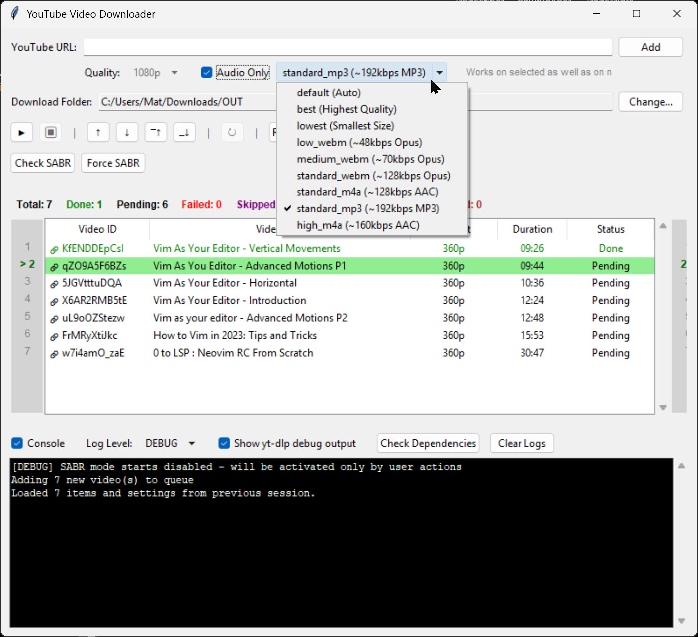
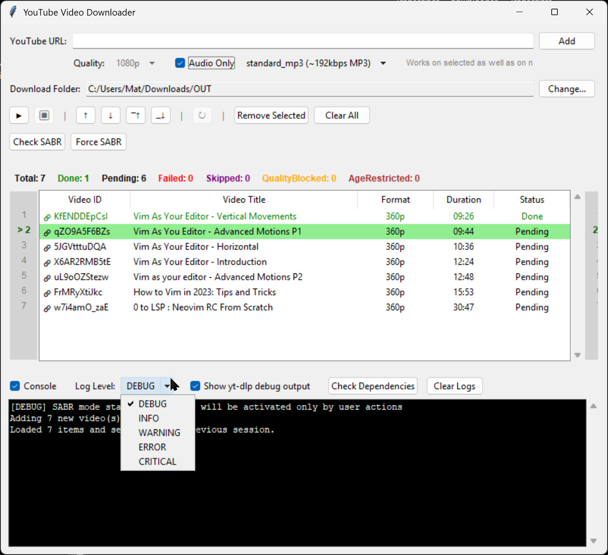

# YouTube Video Downloader

A comprehensive Python GUI application for downloading YouTube videos and playlists with advanced features and user-friendly interface. Built with Python and Tkinter, this downloader offers intelligent SABR bypass capabilities, batch processing, quality selection, and audio extraction.


## ✨ Features

### 🎥 Video & Audio Downloads
- **Multiple Quality Options**: Best, 4K, 2K, 1080p, 720p, 480p, 360p, 240p, 144p, Lowest
- **Audio-Only Downloads**: Extract audio in various formats (MP3, AAC, Opus, WebM)
- **Smart Quality Adjustment**: Automatically adjusts quality based on available formats
- **Format Validation**: Validates downloaded files and reports actual formats/codecs

### 📋 Batch Processing
- **Playlist Support**: Download entire YouTube playlists and channels
- **Queue Management**: Add, remove, reorder, and manage download queues
- **Concurrent Processing**: Efficient batch processing for large playlists
- **Duplicate Detection**: Automatically prevents duplicate downloads

### 🎛️ Advanced Controls
- **Interactive Queue**: Drag, drop, and reorder downloads with visual line numbers
- **Real-time Status**: Color-coded status indicators (Pending, Downloading, Done, Failed, etc.)
- **Progress Tracking**: Live download progress with detailed logging
- **Clickable Video IDs**: Click video IDs to open videos in browser

### 🔧 Smart Features
- **SABR Bypass**: Automatic detection and handling of YouTube's SABR restrictions
- **Caching System**: Intelligent caching to speed up repeated operations
- **FFmpeg Integration**: Automatic detection and use of FFmpeg for format conversion
- **Settings Persistence**: Saves preferences and download history

### 🖥️ User Interface
- **Clean GUI**: Intuitive interface with organized controls and status displays
- **Console Output**: Detailed logging with adjustable verbosity levels
- **Responsive Design**: Resizable interface that adapts to your workflow
- **Status Summary**: Quick overview of download statistics

## 📋 Requirements

### System Requirements
- **Python 3.7+**
- **Operating System**: Windows, macOS, or Linux
- **Internet Connection**: Required for downloading content

### Dependencies
- `yt-dlp` - YouTube downloader library
- `tkinter` - GUI framework (usually included with Python)
- `FFmpeg` (optional but recommended) - For audio format conversion






## 🚀 Installation

### 1. Clone the Repository
```bash
git clone https://github.com/yourusername/youtube-downloader.git
cd youtube-downloader
```

### 2. Install Python Dependencies
```bash
pip install yt-dlp
```

### 3. Install FFmpeg

**⚠️ IMPORTANT**: FFmpeg is required for audio extraction and video processing.

#### Windows - Multiple Options

##### Option 1: Automatic Installation (Recommended)
```cmd
winget install FFmpeg
```

##### Option 2: Package Managers
```bash
# Using Chocolatey
choco install ffmpeg

# Using Scoop
scoop install ffmpeg
```

##### Option 3: Manual Download and PATH Setup
1. **Download FFmpeg**:
   - Go to [FFmpeg Builds](https://github.com/BtbN/FFmpeg-Builds/releases)
   - Download the latest `ffmpeg-master-latest-win64-gpl.zip`
   - Extract the ZIP file to a folder (e.g., `C:\ffmpeg`)

2. **Add to Windows PATH**:
   - Open System Properties (Win + R, type `sysdm.cpl`)
   - Click "Environment Variables"
   - Under "System Variables", find and select "Path"
   - Click "Edit" → "New"
   - Add the path to ffmpeg\bin folder (e.g., `C:\ffmpeg\bin`)
   - Click "OK" to save all dialogs
   - Restart Command Prompt/PowerShell

##### Option 4: Portable Installation
- Place `ffmpeg.exe` in the same folder as the Python script
- No PATH modification needed

#### macOS
```bash
# Using Homebrew (recommended)
brew install ffmpeg

# Using MacPorts
sudo port install ffmpeg

# Manual download
# Download from https://evermeet.cx/ffmpeg/
# Extract and move to /usr/local/bin/
```

#### Linux

##### Ubuntu/Debian
```bash
sudo apt update
sudo apt install ffmpeg
```

##### CentOS/RHEL/Fedora
```bash
# Fedora
sudo dnf install ffmpeg

# CentOS/RHEL (requires EPEL)
sudo yum install epel-release
sudo yum install ffmpeg
```

##### Arch Linux
```bash
sudo pacman -S ffmpeg
```

#### Verify Installation
After installation, verify FFmpeg is working:
```bash
ffmpeg -version
```

You should see version information. If you get "command not found", FFmpeg is not properly installed or not in your PATH.

### 4. Run the Application
```bash
python youtube_downloader.py
```

## 🎯 Quick Start

### Starting the Application

#### From Source
```bash
python youtube_downloader.py
```

#### From Built Executable (if available)
```cmd
yd.exe
```

### Basic Workflow
1. **Add URLs**: Paste YouTube video or playlist URLs in the input field
2. **Select Quality**: Choose video quality or enable audio-only option
3. **Set Download Path**: Choose destination folder using "Change..." button
4. **Start Download**: Click the ▶ (Play) button to begin downloading
5. **Monitor Progress**: Watch real-time progress and status updates in the console

## 📖 Usage Guide

### Supported URL Formats
- **Individual videos**: `https://www.youtube.com/watch?v=VIDEO_ID`
- **Short URLs**: `https://youtu.be/VIDEO_ID`
- **Playlists**: `https://www.youtube.com/playlist?list=PLAYLIST_ID`
- **Channels**: `https://www.youtube.com/channel/CHANNEL_ID`
- **User channels**: `https://www.youtube.com/user/USERNAME`
- **Handle channels**: `https://www.youtube.com/@HANDLE`
- **Shorts**: `https://www.youtube.com/shorts/VIDEO_ID`

### Quality Options

#### Video Quality
- **Best**: Highest available quality (up to 4K+)
- **2160p (4K)**: 4K resolution
- **1440p (2K)**: 2K resolution  
- **1080p**: Full HD
- **720p**: HD
- **480p**: Standard definition
- **360p**: Low quality (SABR-compatible)
- **240p/144p**: Very low quality
- **Lowest**: Smallest file size

#### Audio Formats
- **default (Auto)**: Best available audio format
- **best (Highest Quality)**: Highest bitrate available
- **lowest (Smallest Size)**: Lowest bitrate for small files
- **Opus formats**: WebM containers with Opus codec (~48-128kbps)
- **AAC formats**: M4A containers with AAC codec (~128-160kbps)
- **MP3**: Requires FFmpeg for conversion (~192kbps)

### Interface Elements

#### Top Section
- **URL Input**: Enter YouTube URLs (videos, playlists, channels)
- **Quality Selection**: Dropdown menu for video quality options
- **Audio Only**: Checkbox for audio extraction with format selection
- **Download Path**: Configurable destination folder with "Change..." button

#### Main Table
- **Video ID**: Clickable YouTube video identifier (🔗 icon indicates clickable)
- **Video Title**: Full title of the video
- **Format**: Selected quality or audio format
- **Duration**: Video length in MM:SS or HH:MM:SS format
- **Status**: Current download status with color coding

#### Queue Management

##### Control Buttons
- **▶ (Play)**: Start downloading queued items
- **⏹ (Stop)**: Stop current downloads
- **↑/↓**: Move selected items up/down in queue
- **⎺↑/⎽↓**: Move selected items to top/bottom
- **↻ (Reset)**: Reset failed downloads to pending
- **Remove Selected**: Remove selected items from queue
- **Clear All**: Clear entire queue

##### Status Summary
Real-time counters showing:
- **Total**: Total number of videos in queue (black)
- **Done**: Successfully downloaded videos (green)
- **Pending**: Videos waiting to download (black)
- **Failed**: Videos that failed to download (red)
- **Skipped**: Videos that were skipped due to existing files (purple)
- **QualityBlocked**: Videos with unavailable quality (orange)
- **AgeRestricted**: Age-restricted content (brown)
- **Downloading**: Currently downloading videos (blue)

#### Status Indicators
Individual video status with color coding:
- **Pending**: Waiting to download (black)
- **↓ Downloading**: Currently downloading (blue)
- **✓ Done**: Successfully downloaded (green)
- **✗ Failed**: Download failed (red)
- **⊘ Skipped**: Skipped due to existing file (purple)
- **⚠ QualityBlocked**: Quality not available (orange)
- **🔞 AgeRestricted**: Age-restricted content (brown)

### SABR Bypass Features

YouTube's SABR (Streaming Audio/Video Bitrate Reduction) protocol can restrict access to higher quality formats. This application includes:

- **Automatic Detection**: Detects SABR restrictions during downloads
- **Smart Fallbacks**: Automatically switches to compatible formats
- **Manual Controls**: "Check SABR" and "Force SABR" buttons for manual control
- **Quality Adjustment**: Limits options to SABR-compatible formats when needed

### Console and Logging

#### Progress Log Section
- **Real-time Logging**: Download progress and system messages
- **Console Visibility**: Toggle console display on/off
- **Log Levels**: Configurable verbosity (DEBUG to CRITICAL)
- **yt-dlp Debug**: Toggle detailed yt-dlp output for troubleshooting
- **Clear Logs**: Clear console output
- **Check Dependencies**: Verify yt-dlp and FFmpeg installation
- **Error Details**: Comprehensive error reporting with solutions

#### Log Levels
- **DEBUG**: Detailed technical information and troubleshooting data
- **INFO**: General information and progress updates
- **WARNING**: Important notices and fallback actions
- **ERROR**: Error messages and failures
- **CRITICAL**: Critical system errors

## ⚙️ Configuration

### Settings File
The application automatically saves settings to `settings.json`:
- Download path preferences
- Quality selections
- Console visibility and log levels
- Window geometry and interface state
- Queue state (videos and their status)

### Download Archive
Downloads are tracked in `download-archive.txt` to prevent re-downloading:
- Located in your download folder
- Tracks successfully downloaded videos by ID
- Prevents duplicate downloads automatically
- Can be manually edited if needed

### Quality Auto-Adjustment
When requested quality is unavailable, the application intelligently:
- Automatically selects the highest available quality ≤ requested quality
- If no suitable quality found, uses the highest available quality
- Logs all quality adjustments for transparency
- Works seamlessly with SABR restrictions
- Provides fallback options for restricted content

## 🔧 Advanced Features

### Caching System
- **Info Caching**: Caches video metadata for 5 minutes
- **Batch Processing**: Optimized for large playlists
- **Memory Management**: Automatic cleanup of expired cache entries

### File Validation
- **Format Detection**: Analyzes downloaded files to determine actual formats
- **Size Verification**: Checks file sizes and reports empty downloads
- **Codec Analysis**: Uses FFprobe when available for detailed format information

### Error Handling
- **Graceful Failures**: Continues processing other items when individual downloads fail
- **Retry Logic**: Built-in retry mechanisms for network issues
- **User Feedback**: Clear error messages and suggested solutions

## 🐛 Troubleshooting

### Common Issues

#### yt-dlp Not Found
**Problem**: "yt-dlp not found in system PATH"
**Solution**:
```bash
pip install --upgrade yt-dlp
```

#### FFmpeg Not Found
**Problem**: "FFmpeg not found in system PATH" or "FFmpeg not found or not accessible"
**Solutions**:
- Verify FFmpeg installation: `ffmpeg -version`
- Restart Command Prompt/Terminal after PATH changes
- Try portable installation (place ffmpeg.exe next to Python script)
- For Windows: Use `winget install FFmpeg` for automatic installation

#### FFmpeg Errors
**Problem**: "Postprocessing: Error opening input files"
**Solutions**:
- Update FFmpeg to latest version
- Try lower quality settings
- Download as audio-only
- Check internet connection stability
- Verify FFmpeg is working: `ffmpeg -version`

#### Downloads fail with "SABR" errors
**Problem**: Videos fail with SABR-related errors
**Solutions**:
- Use "Check SABR" button to detect restrictions
- Try lower quality settings (360p or audio-only)
- Use "Force SABR" mode for restricted content
- Enable automatic SABR detection in settings

#### Download Failures
**Problem**: Videos fail to download
**Solutions**:
- Verify URL is accessible and not region-restricted
- Update yt-dlp: `pip install --upgrade yt-dlp`
- Try different quality settings
- Check for age restrictions or private videos

#### Slow Performance
**Problem**: Application runs slowly or playlist processing is slow
**Solutions**:
- Large playlists are processed in batches automatically
- Close other bandwidth-intensive applications
- Use lower quality settings for faster downloads
- Check available disk space
- Consider using lower log levels to reduce output

### Dependency Check
Use the built-in "Check Dependencies" button to:
- Verify yt-dlp installation and version
- Check FFmpeg availability
- Update yt-dlp to latest version
- Get installation instructions for missing dependencies

## 🔧 Technical Details

### Architecture
- **GUI Framework**: tkinter with ttk widgets for modern appearance
- **Download Engine**: yt-dlp library with custom integration
- **Video Processing**: FFmpeg for format conversion and audio extraction
- **Threading**: Asynchronous downloads with real-time progress reporting
- **Data Persistence**: JSON-based settings and queue storage
- **Caching System**: Intelligent metadata caching for improved performance

### External Dependencies
- **FFmpeg**: Required for video processing and audio extraction
- **yt-dlp**: Core downloading functionality
- **Python libraries**: Standard library components (tkinter, threading, json, etc.)

## 🤝 Contributing

Contributions are welcome! Please feel free to submit a Pull Request. For major changes, please open an issue first to discuss what you would like to change.

### Bug Reports
Please include:
- Operating system and version
- Python version (`python --version`)
- yt-dlp version (`yt-dlp --version`)
- FFmpeg version (`ffmpeg -version`)
- Complete error messages from the console
- Steps to reproduce the issue

### Feature Requests
- Describe the desired functionality clearly
- Explain the use case and benefits
- Consider implementation complexity and compatibility

### Development Setup
1. Fork the repository
2. Create a feature branch (`git checkout -b feature/AmazingFeature`)
3. Commit your changes (`git commit -m 'Add some AmazingFeature'`)
4. Push to the branch (`git push origin feature/AmazingFeature`)
5. Open a Pull Request

## 📄 License

This project is licensed under the MIT License - see the [LICENSE](LICENSE) file for details.

## 🙏 Acknowledgments

- **yt-dlp**: The powerful YouTube downloader library that makes this possible
- **FFmpeg**: For audio/video processing capabilities
- **Python Tkinter**: For the GUI framework
- **YouTube**: For providing the content platform

## 📞 Support

If you encounter any issues or have questions:

1. Check the [Troubleshooting](#-troubleshooting) section
2. Use the "Check Dependencies" button in the application
3. Open an issue on GitHub with:
   - Your operating system
   - Python version
   - Error messages from the console
   - Steps to reproduce the issue

## 🏗️ Building Executable

### Creating Standalone Executable
For Windows users, you can build a standalone executable:

```cmd
build.bat
```

**Important Notes**:
- The built executable does NOT include FFmpeg
- FFmpeg must be installed separately (see installation instructions above)
- The build script will display FFmpeg installation instructions after completion
- Executable size is significantly smaller without bundled FFmpeg
- Users always get the latest FFmpeg version instead of a bundled version

### Build Requirements
- Python 3.7+
- PyInstaller: `pip install pyinstaller`
- All application dependencies installed

## 🔄 Updates

### Version Updates

#### Updating yt-dlp
The application includes automatic update checking for yt-dlp. To manually update:
```bash
pip install --upgrade yt-dlp
```

#### Updating FFmpeg
- **Windows**: Download latest from [FFmpeg Builds](https://github.com/BtbN/FFmpeg-Builds/releases) or `winget upgrade FFmpeg`
- **macOS**: `brew upgrade ffmpeg`
- **Linux**: `sudo apt upgrade ffmpeg` (Ubuntu/Debian) or equivalent for your distribution

#### Updating the Application
For the application itself, pull the latest changes from the repository:
```bash
git pull origin main
```

## 📋 Version Information

**Version**: 2.0.0  
**Last Updated**: 2025  
**Compatibility**: Python 3.7+, Windows/macOS/Linux  
**Key Features**: SABR Bypass, Batch Processing, Smart Quality Adjustment

---

## ⚖️ Disclaimer

This tool is for educational and personal use only. Users are responsible for complying with YouTube's Terms of Service and applicable copyright laws. The developers are not responsible for any misuse of this software. Only download content you have the right to download.